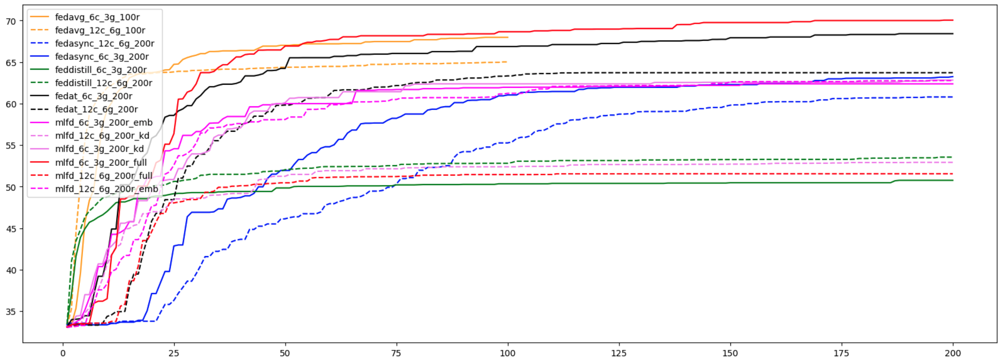

# Multilingual Federated Distillation

A federated learning framework for multilingual NLP that tackles two problems at once: clients speaking different languages (data heterogeneity) and clients running on wildly different hardware (latency heterogeneity). Built as a graduate research project at the University of Oregon.

## Overview

Standard federated learning assumes clients are roughly homogeneous. In multilingual settings that assumption breaks — a client training on Chinese text has different vocabulary overlap, gradient directions, and often different hardware than one training on English. MlFD addresses this with three coordinated mechanisms:

1. **Semi-asynchronous tier training** — Clients are grouped into language tiers. Intra-tier aggregation is synchronous (FedAvg), while cross-tier aggregation is asynchronous (FedAsync). Same-language clients tend to have similar latencies; different-language clients don't, and the two-level design reflects that.
2. **Personalized tokenizer** — Each client derives a vocabulary from its own data and uploads only the corresponding embedding rows. The server aggregates these sparse updates into the global multilingual embedding, reducing per-round payload from ~1 GB to under 50 MB.
3. **Federated distillation** — Per-label mean logit vectors are aggregated server-side and redistributed as knowledge-distillation soft targets, letting clients use lightweight local models while still benefiting from cross-lingual knowledge sharing.



*Figure: Convergence curves for all methods. x-axis = communication round; y-axis = average client accuracy. Semi-asynchronous methods (FedAT, MlFD) converge substantially faster.*

## Installation

```bash
git clone https://github.com/ngotrnghia1811/multilingual-federated-distillation
cd multilingual-federated-distillation
pip install -e .
pip install -r requirements.txt
```

**Hardware**: Experiments were run on a node with 4× NVIDIA V100 GPUs. At minimum, one GPU is required for XLMR experiments.

## Data

XNLI from the [XGLUE benchmark](https://arxiv.org/abs/2004.01401) is downloaded automatically via HuggingFace `datasets` on first run. See [`data/README.md`](data/README.md) for details on how XNLI is adapted to the federated setting.

## Running Experiments

### MlFD (proposed method)

```bash
# Base setting: 6 clients, 3 language groups, XLM-RoBERTa-Base
bash scripts/run_mlfd_base.sh

# Mini setting: 12 clients, 6 language groups, Multilingual-MiniLM
bash scripts/run_mlfd_mini.sh
```

### Baselines

```bash
# Run FedAT, FedAsync, and FedDistill on the Base setting
bash scripts/run_baselines.sh
```

### Custom Configuration

```bash
python train.py --config configs/mlfd_base.yaml --method mlfd
```

Key parameters in `configs/mlfd_base.yaml`:

| Parameter | Default | Description |
|-----------|---------|-------------|
| `clients.total_clients` | 6 | Total number of FL clients |
| `server.num_groups` | 3 | Number of language tiers |
| `server.global_embedding` | true | Transmit embeddings only (MlFD\_emb mode) |
| `trainer.model_name` | xlm-roberta-base | HuggingFace model checkpoint |
| `trainer.reg_alpha` | 1.0 | KD loss weight (λ) |
| `clients.max_sleep_time` | 240 | Max latency simulation (seconds) |

## Results

**Metric**: average client accuracy on XNLI. Elapsed time = wall-clock time to convergence (round 100, except FedAsync at round 200). Payload = per-round upload size per client.

### Main Results (Table 1)

| Method | Setting | Accuracy | Time (h) | Payload (MB) |
|--------|:-------:|:--------:|:--------:|:------------:|
| FedAvg | Base (6c / 3g, XLMR) | 68.0 | 6.5 | 1060.66 |
| FedAsync | Base | 61.0 | 7.6 | 1060.66 |
| FedAT | Base | 66.9 | 1.8 | 1060.66 |
| FedDistill | Base | 50.3 | 7.0 | < 1 |
| **MlFD** | **Base** | **62.0** | **1.6** | **< 50** |
| FedAvg | Mini (12c / 6g, mMiniLM) | 65.0 | 6.1 | 448.82 |
| FedAsync | Mini | 55.3 | 5.5 | 448.82 |
| FedAT | Mini | 63.0 | 1.1 | 448.82 |
| FedDistill | Mini | 52.8 | 5.4 | < 1 |
| **MlFD** | **Mini** | **63.4** | **0.9** | **< 10** |

MlFD is the **fastest** method to converge and achieves **>90% reduction in communication payload** compared to full-model methods, while remaining competitive in accuracy.

### Ablation Study (Table 2)

| Variant | Description | Base Acc. | Mini Acc. | Payload |
|---------|-------------|:---------:|:---------:|---------|
| MlFD\_kd | KD only, no embedding aggregation | 62.4 | 52.4 | < 1 MB |
| MlFD\_full | Full weights + KD | 68.6 | 51.4 | ~1 GB / ~449 MB |
| **MlFD\_emb** | **Embedding aggregation + KD (proposed)** | **62.0** | **63.4** | **< 50 MB / < 10 MB** |

In the **Mini setting** (mMiniLM, 82% embedding parameters), embedding aggregation is decisive: MlFD\_emb outperforms MlFD\_kd by **+11 accuracy points**. In the Base setting (XLMR, 69% embedding), the 31% encoder bottleneck limits the benefit of embedding aggregation alone.

## Implementation Notes

- Built on [Plato](https://github.com/TL-System/plato), an open-source FL research framework that provides the WebSocket-based client-server communication, wall-clock time simulation, and sampler infrastructure.
- All MLLMs are initialized from HuggingFace pre-trained checkpoints.
- The personalized vocabulary for each client is derived by collecting all unique `input_ids` from that client's local train and test splits after tokenization.

## License

MIT
